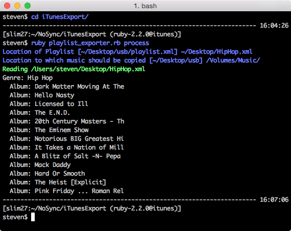

# ITunes Playlist To USB

## The Problem
Lots of cars now have USB interfaces to allow you to bring music with you. Those are great because you can buy a USB stick for much lower $/GB than by getting the storage space as part of an iPod.

But I ran into a problem getting music copied over from my iTunes library onto the USB stick in a way that I could use it.

The first problem was that with a lot of music, I find it helpful to organize it by Genre and then by Album.  That lets me quickly navigate to the album / songs I'm looking for.  iTunes lets you drag (copy) music over to a USB stick, but then you just get all the files dropped into a single folder with no organization.

The second problem I ran into was that what ends up in that folder is a copy of the file where the name is whatever the underlying filename was originally created as, but that often includes all kinds of other information (junk) depending on what software was used to rip the song. Any cleanup you've done in iTunes to improve the name (or fix other meta data) is ignore.  You just get the original file name.

## Usage
To use the playlist_exporter (this script), you:

* create a playlist(s) containing the songs / albums you want in iTunes

* export the playlist as XML

* run playlist_exporter

~~~~
ruby playlist_exporter.rb process
~~~~

and it will copy all the songs from the playlist onto the USB stick organized in a hierarchy of Genre and Album using the iTunes meta data.  It will generate new file names that are

~~~~
	<track number>-<song name from iTunes>
    #==> 9-Rock of Ages.mp3
~~~~
